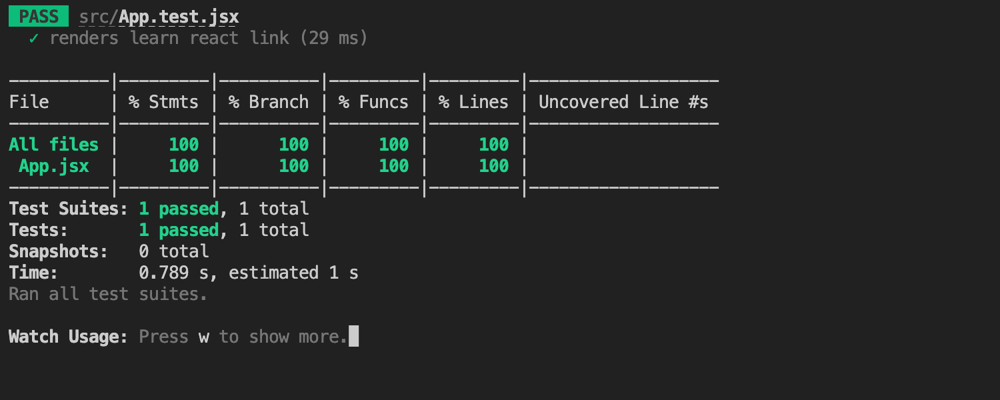

# HISTORY

- [HISTORY](#history)
  - [Environment](#environment)
  - [Project](#project)
    - [Initiation](#initiation)
    - [Setup Node Version \& Package Manager](#setup-node-version--package-manager)
      - [Replace default dependencies in CRA](#replace-default-dependencies-in-cra)
  - [Coding style convention](#coding-style-convention)
    - [Basic ESLint eco-system for React](#basic-eslint-eco-system-for-react)
    - [JavaScript coding styling: Extend JavaScript Standard Style](#javascript-coding-styling-extend-javascript-standard-style)
    - [TypeScript coding styling: Extend TypeScript Standard Style](#typescript-coding-styling-extend-typescript-standard-style)
    - [Check all about styling](#check-all-about-styling)
    - [SCSS Styling: Style Lint with Community Standard on SCSS](#scss-styling-style-lint-with-community-standard-on-scss)
    - [VCM Integration: Husky and Lint-staged](#vcm-integration-husky-and-lint-staged)
    - [Testing setup](#testing-setup)
    - [Check](#check)
    - [Ecosystem](#ecosystem)

## Environment

1. [Install nvm(Node Version Manager)](https://github.com/nvm-sh/nvm#installing-and-updating)

   ```bash
   # Check
   nvm --version
   ```

2. Auto setting node environment from `.nvmrc`

   ```bash
   # Open the shell control file
   vi ~/.zshrc
   ```

   Append below script after `nvm` part.

   ```bash
   # Ref. https://readforlearn.com/how-to-write-a-nvmrc-file-which-automatically-change-node-version/
   autoload -U add-zsh-hook
   load-nvmrc() {
     local node_version="$(nvm version)"
     local nvmrc_path="$(nvm_find_nvmrc)"

     if [ -n "$nvmrc_path" ]; then
       local nvmrc_node_version=$(nvm version "$(cat "${nvmrc_path}")")

       if [ "$nvmrc_node_version" = "N/A" ]; then
         nvm install
       elif [ "$nvmrc_node_version" != "$node_version" ]; then
         nvm use
      fi
     elif [ "$node_version" != "$(nvm version default)" ]; then
       echo "Reverting to nvm default version"
       nvm use default
    fi
   }
   add-zsh-hook chpwd load-nvmrc
   load-nvmrc
   ```

   Save and quit(`esc` + `:wq`), then reopen your terminal.

3. Install node environment

   ```bash
   # Setup node manager
   nvm install --lts 18

   # Check
   nvm current
   nvm list --no-alias
   node --version

   # Setup package manger
   npm install --global npm   # Maybe need to set tslint.json version. Please check the console
   npm install --global yarn

   # Check
   npm --version
   yarn --version
   ```

## Project

### Initiation

```bash
# Init React application with CRA
yarn dlx create-react-app@latest

cd <root-of-project>
yarn create-react-app .
```

- **Update [`.gitignore`](.gitignore)**

### Setup Node Version & Package Manager

```bash
# At the root of repository where package.json is presented.
# Migrate Yarn Berry
yarn set version stable

# Clean install with Yarn Berry
yarn cache clean --all
yarn install #--immutable
```

> Learn more: [Migration Yarn2 step-by-step](https://yarnpkg.com/getting-started/migration#step-by-step)

```bash
# Set node version with nvm
touch .nvmrc # edit the file

# Or update current node version
node -v > .nvmrc && cat .nvmrc
```

```bash
# Yarn berry with VScode
yarn dlx @yarnpkg/sdks vscode

# Yarn Contraints plugin
yarn plugin import constraints
# yarn constraints --fix

# Yarn Upgrade plugin
yarn plugin import interactive-tools
# yarn upgrade-interactive
```

- [`yarn upgrade-interactive`](https://yarnpkg.com/cli/upgrade-interactive)

#### Replace default dependencies in CRA

```bash
# Global install for CLI
yarn dlx eslint

# For eslintConfig dependency resolve
yarn add --dev \
    eslint \
    eslint-plugin-react \
    eslint-plugin-jest
```

- After install, then remove below lines in `package.json`.

  ```diff
  // package.json
    {
      ...
  -   "eslintConfig": {
  -     "extends": [
  -       "react-app",
  -       "react-app/jest"
  -     ]
  -   },
      ...
    }
  ```

## Coding style convention

### Basic [ESLint](https://eslint.org/) eco-system for React

```bash
# React for ESLint (not control in CRA)
yarn add --dev \
    @babel/eslint-parser \
    @babel/preset-react \
    eslint-plugin-import \
    eslint-plugin-jest \
    eslint-plugin-n \
    eslint-plugin-node \
    eslint-plugin-promise \
    eslint-plugin-react
```

```javascript
// in .eslintrc.js
{
  env: {
    "jest/globals": true,
  },
  settings: {
    react: {
      version: "detect",
    },
  },
  parser: "@babel/eslint-parser",
  parserOptions: {
    ecmaVersion: "latest",
    ecmaFeatures: {
      jsx: true,
    },
    sourceType: "module",
  },
  plugins: [
    "jest",
  ],
  extends: [
    // Ref. > https://github.com/jsx-eslint/eslint-plugin-react#readme
    "eslint:recommended",
    "plugin:react/recommended"
  ]
}
```

```javascript
// in .babelrc
{
  "presets": [
    "@babel/preset-react"
  ]
}
```

### JavaScript coding styling: Extend [JavaScript Standard Style](https://standardjs.com/)

```bash
# Extend Statandard Style
yarn add --dev \
    eslint-config-standard \
    eslint-config-standard-jsx \
    eslint-config-standard-react\
    eslint-plugin-standard

# prettier
yarn add --dev \
    prettier \
    eslint-config-prettier
```

```javascript
// in .eslintrc.js
{
  extends: [
    // Ref. > https://www.npmjs.com/package/eslint-config-standard-react
    "standard",
    "standard-jsx",
    "standard-react",
  ],
  // optional
  rules: {
    // Override Standard JS style
    "comma-dangle": [
      "error",
      {
        arrays: "always-multiline",
        objects: "always-multiline",
        imports: "only-multiline",
        exports: "only-multiline",
        functions: "only-multiline",
      },
    ],
    quotes: ["error", "double"],
    semi: ["error", "always"],
  },
}
```

### [TypeScript](https://www.typescriptlang.org/) coding styling: Extend [TypeScript Standard Style](https://www.npmjs.com/package/eslint-config-standard-with-typescript)

```bash
# Enable TypeScript
yarn add --dev \
    typescript \
    @types/node \
    @types/react \
    @types/react-dom \
    @types/jest

# Add Plugin for Yarn Berry
yarn plugin import typescript
```

```json
// tsconfig.json
{
  "compilerOptions": {
    "target": "es5",
    "lib": ["dom", "dom.iterable", "esnext"],
    "allowJs": true,
    "skipLibCheck": true,
    "esModuleInterop": true,
    "allowSyntheticDefaultImports": true,
    "strict": true,
    "forceConsistentCasingInFileNames": true,
    "noFallthroughCasesInSwitch": true,
    "module": "esnext",
    "moduleResolution": "node",
    "resolveJsonModule": true,
    "isolatedModules": true,
    "noEmit": true,
    "jsx": "react-jsx"
  },
  "include": ["src"]
}
```

- Helpful references:
  - [React TypeScript Cheatsheet - Setup TypeScript with React](https://react-typescript-cheatsheet.netlify.app/docs/basic/setup/)
  - [Create React App - Adding TypeScript](https://create-react-app.dev/docs/adding-typescript/)

```bash
yarn add --dev \
    eslint-config-standard-with-typescript \
    eslint-plugin-react-hooks \
    @typescript-eslint/eslint-plugin \
    @typescript-eslint/parser
```

```javascript
// in .eslintrc.js
{
  parserOptions: {
    project: './tsconfig.json'
  },
  extends: [
    // Ref. > https://www.npmjs.com/package/eslint-config-standard-with-typescript
    "standard-with-typescript"
  ],
}
```

### Check all about styling

- check [`tsconfig.json`](tsconfig.json)

- check [`.eslintrc.js`](.eslintrc.js)

- check [`.eslintignore`](.eslintignore)

- check [`.babelrc`](.babelrc)

- check [`.prettierignore`](.prettierignore)

  > Set style sheets ignore.
  > These are controlled by [Style Lint](https://stylelint.io/).

### SCSS Styling: [Style Lint](https://stylelint.io/) with [Community Standard on SCSS](https://www.npmjs.com/package/stylelint-config-standard-scss)


```bash
# Add lint system
yarn add --dev \
    stylelint \
    stylelint-config-standard \
    stylelint-config-standard-scss
```

```javascript
// .stylelintrc.js
// Ref. > https://stylelint.io/user-guide/configure
module.exports = {
  extends: [
    // Ref. > https://github.com/stylelint-scss/stylelint-config-standard-scss#readme
    "stylelint-config-standard",
    "stylelint-config-standard-scss",
  ],
};
```

- check [`.stylelintrc.js`](.stylelintrc.js)

- cheeck [`.stylelintignore`](.stylelintignore)

### VCM Integration: [Husky](https://typicode.github.io/husky/#/) and [Lint-staged](https://github.com/okonet/lint-staged#readme)

```bash
# Add integtation system
yarn add --dev \
    husky \
    lint-staged

# Add enabled husky's hook
npx husky-init --yarn2 && yarn
```

```json
// in package.json
{
  "scripts": {
    "postinstall": "husky install",
    "lint": "lint-staged"
  },
  "husky": {
    "hooks": {
      "pre-commit": "lint-staged --allow-empty"
    }
  },
  "lint-staged": {
    "*.{js,jsx,ts,tsx}": ["eslint --cache --fix", "prettier --write"],
    "*.css": ["stylelint --fix"],
    "*.scss": ["stylelint --syntax=scss --fix"],
    "*.{json,md}": ["prettier --write"]
  }
}
```

> Read more: [Husky for Yarn 2](https://typicode.github.io/husky/#/?id=yarn-2)

```json
// .vscode/setting.json
{
  "editor.codeActionsOnSave": {
    "source.fixAll.eslint": true
  },
  "editor.formatOnSave": true,
  "editor.formatOnPaste": false,
  "eslint.nodePath": ".yarn/sdks",
  "eslint.validate": ["javascript"],
  "prettier.prettierPath": ".yarn/sdks/prettier/index.js",
  "search.exclude": {
    "**/.yarn": true,
    "**/.pnp.*": true
  },
  "typescript.enablePromptUseWorkspaceTsdk": true,
  "typescript.tsdk": ".yarn/sdks/typescript/lib"
}
```

```bash
# Check husky auto install
yarn cache clean --all
yarn install --immutable # --> Find out .husky/ folder

# Lint testing
git add .
yarn lint
```

### Testing setup

```json
// in package.json
{
  "scripts": {
    "test": "react-scripts test --coverage"
  },
  "jest": {
    "collectCoverageFrom": [
      "src/**/*.{js,jsx,ts,tsx}",
      "!src/index.{js,jsx,ts,tsx}"
    ],
    "coverageThreshold": {
      "global": {
        "branches": 100,
        "functions": 100,
        "lines": 100,
        "statements": 100
      }
    },
    "coverageReporters": ["json", "html", "lcov", "text"]
  }
}
```

> **Must read: [Create React App uses for Jest Supported overrides](https://create-react-app.dev/docs/running-tests/#configuration)**

### Check

```bash
# React app in dev
yarn start

# React app testing
yarn test
```



```bash
# For static resource hosting test
yarn add --dev serve

# Check react app with static hosting
yarn build
serve -s build -l 1234
```

### Ecosystem

```bash
# Install React Router
yarn add react-router-dom

# Install user-event for using a higher-level abstraction, not the fireEvent
yarn add --dev \
    @testing-library/dom \
    @testing-library/user-event
```

Check [`src/Router.tsx`](./src/Router.tsx) and [`src/Router.test.tsx`](./src/Router.test.tsx)

- Read more:
  - [React Router](https://reactrouter.com/en/main/start/overview)
    with [Examples](https://github.com/remix-run/react-router/tree/main/examples)
  - [user-event](https://testing-library.com/docs/user-event/intro#writing-tests-with-userevent)
    ([package](https://www.npmjs.com/package/@testing-library/user-event))
  - [Avoid Nesting when you're Testing](https://kentcdodds.com/blog/avoid-nesting-when-youre-testing)
