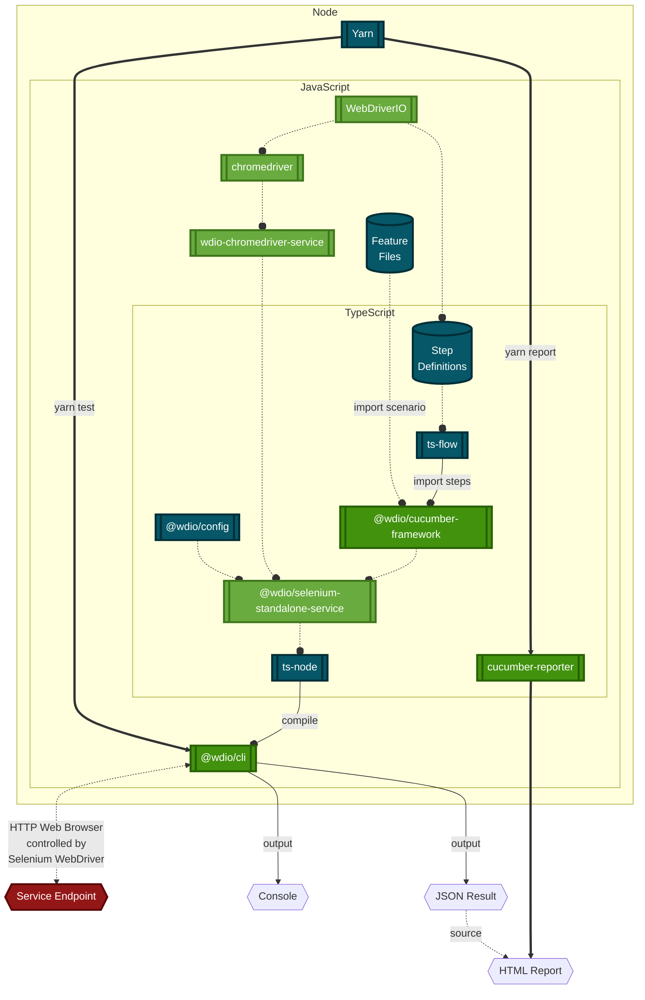

# DAY1-UI Tech-Stack

- [DAY1-UI Tech-Stack](#day1-ui-tech-stack)
  - [Overview](#overview)

## Overview

```mermaid
%%{ init: { "fontFamily": "Noto Sans KR, sans-serif" } }%%
flowchart TB
  %% Style
  classDef Role color:#050505,fill:#fad7ac,stroke:#be7a26,stroke-width:3px
  classDef Support color:#ffffff,fill:#065767,stroke:#012e37,stroke-width:3px
  classDef Core color:#ffffff,fill:#69ab3e,stroke:#3f761c,stroke-width:3px
  classDef Process color:#ffffff,fill:#42920e,stroke:#286003,stroke-width:3px
  classDef Target color:#ffffff,fill:#941717,stroke:#5e0707,stroke-width:3px

  %% Group
  Endpoint{{ Service Endpoint }}:::Target
  subgraph Node
    direction TB
    Yarn[[ Yarn ]]:::Support
    subgraph JavaScript
      direction TB
      WDIO[[ WebDriverIO ]]:::Core
      WDIOChrome[[ chromedriver ]]:::Core
      WDIOChromeSrv[[ wdio-chromedriver-service ]]:::Core
      Feature[( Feature\nFiles )]:::Support
      subgraph TypeScript
        direction TB
        Steps[( Step\nDefinitions )]:::Support
        REPORTER[[ cucumber-reporter ]]:::Process
        TSFLOW[[ ts-flow ]]:::Support
        WDCONF[["@wdio/config"]]:::Support
        WDCF[["@wdio/cucumber-framework"]]:::Process
        WDSS[["@wdio/selenium-standalone-service"]]:::Core
        TSNODE[[ ts-node ]]:::Support
      end
      WDCLI[["@wdio/cli"]]:::Process
    end
  end
  CONSOLE{{ Console }}
  RESULT{{ JSON Result }}
  REPORT{{ HTML Report }}

  %% Link
  Yarn ==>|yarn test| WDCLI

  %% WDCONF -.-o WDSS
  WDCONF -.-o WDSS
  WDIO -.-o WDIOChrome -.-o WDIOChromeSrv -....-o WDSS
  Feature -...-o|import scenario|WDCF
  WDCF -.-o WDSS -.-o TSNODE
  WDIO -.-o Steps -.-o TSFLOW --o|import steps| WDCF

  TSNODE --o|compile| WDCLI
  WDCLI <-.->|HTTP Web Browser \n controlled by \n Selenium WebDriver| Endpoint
  WDCLI -->|output| CONSOLE & RESULT
  RESULT -.->|source| REPORT
  Yarn =========>|yarn report| REPORTER ==> REPORT
```
